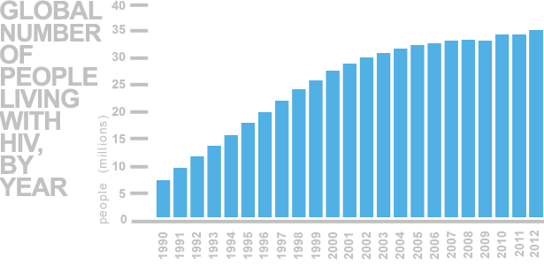

Genetic Immunity to HIV/AIDS
========================================================
author: Mindy Ng
date: 10/24/15
font-family: 'Helvetica'
transition: rotate

First Slide - HIV/AIDS Stats/Risks
========================================================




HIV Resistance
========================================================

Some people are naturally resistant to infection with HIV (the virus that causes AIDS) due to Delta32 mutation in the CCR5 gene that prevents the CCR5 protein from reaching the surface of the immune cells. The CCR5 protein is one of the proteins HIV uses to bind to and enter immune cells, so people who have two copies of CCR5Delta32 are almost completely resistant to HIV infection.	The protection given by CCR5Delta32 mutation is incomplete though, because some strains of HIV can use another protein called CXCR4 to bind to immune cells. This calculator uses a single gene (CCR5) complete dominance model, with the resistance trait being recessive.

HIV Resistance Prediction
========================================================

I built an application for your personal use that completes this operation:


```r
HIVRisk<-function(HIV) (HIV/2)*100
```

Based on this simple calculation with HIV=number of parents carrying mutated gene, you can predict how resistant you will be to HIV/AIDS.

Assumption: This is a reminder that this calculator uses a single gene (CCR5) complete dominance model, with the resistance trait being recessive.
Caveat: This calculator is not a catch-all for determining resistance to HIV/AIDS. As a reminder, protection given by CCR5Delta32 mutation is incomplete because some strains of HIV can use another protein called CXCR4 to bind to immune cells.

Detection and Early Treatment
========================================================
By using this application, HIV/AIDS risk can be determined early on. And if treatment is needed, it can be done earlier to increase chances of survival.


